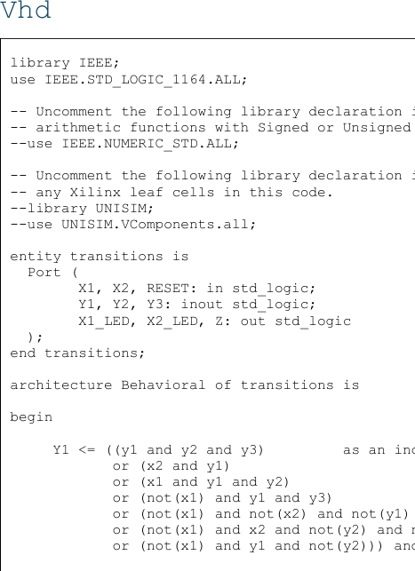
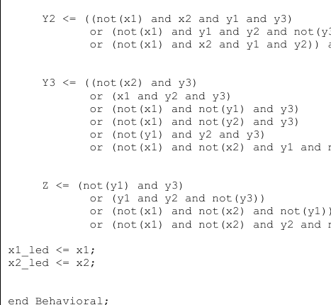
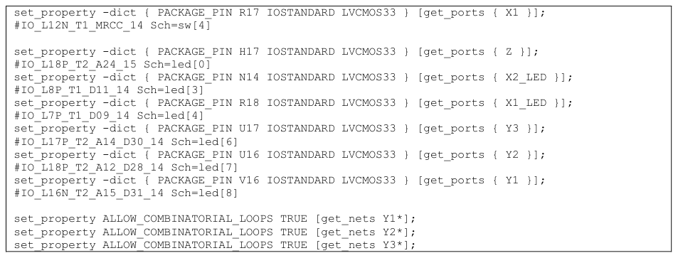
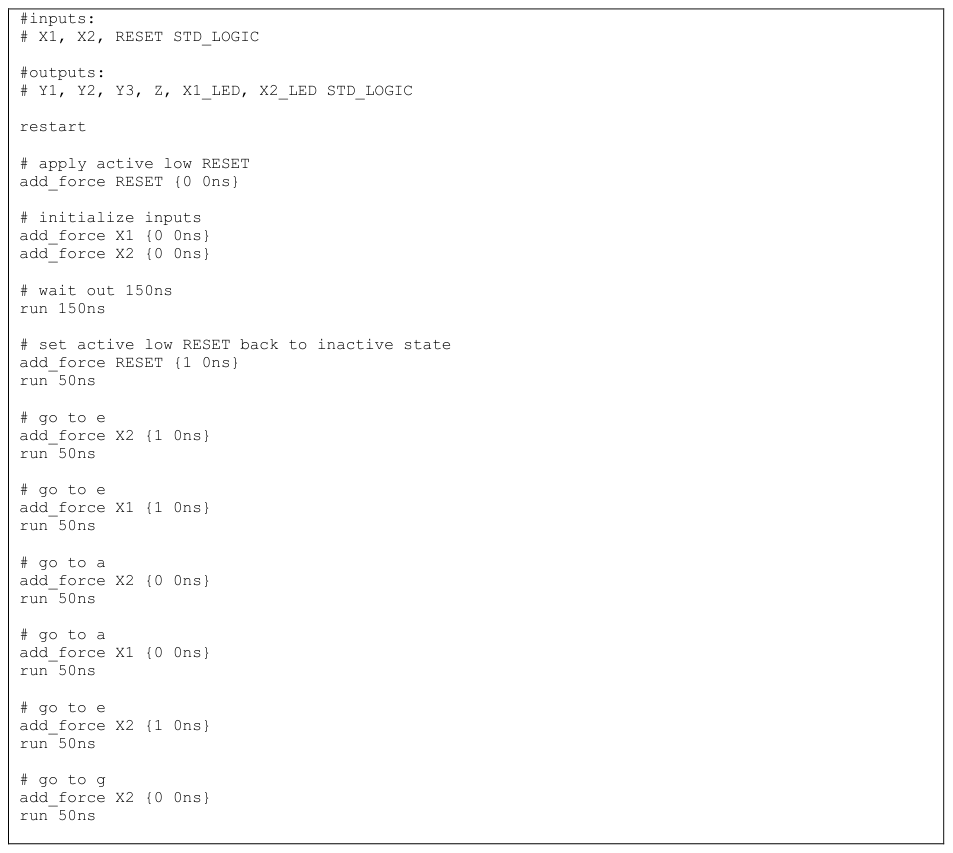
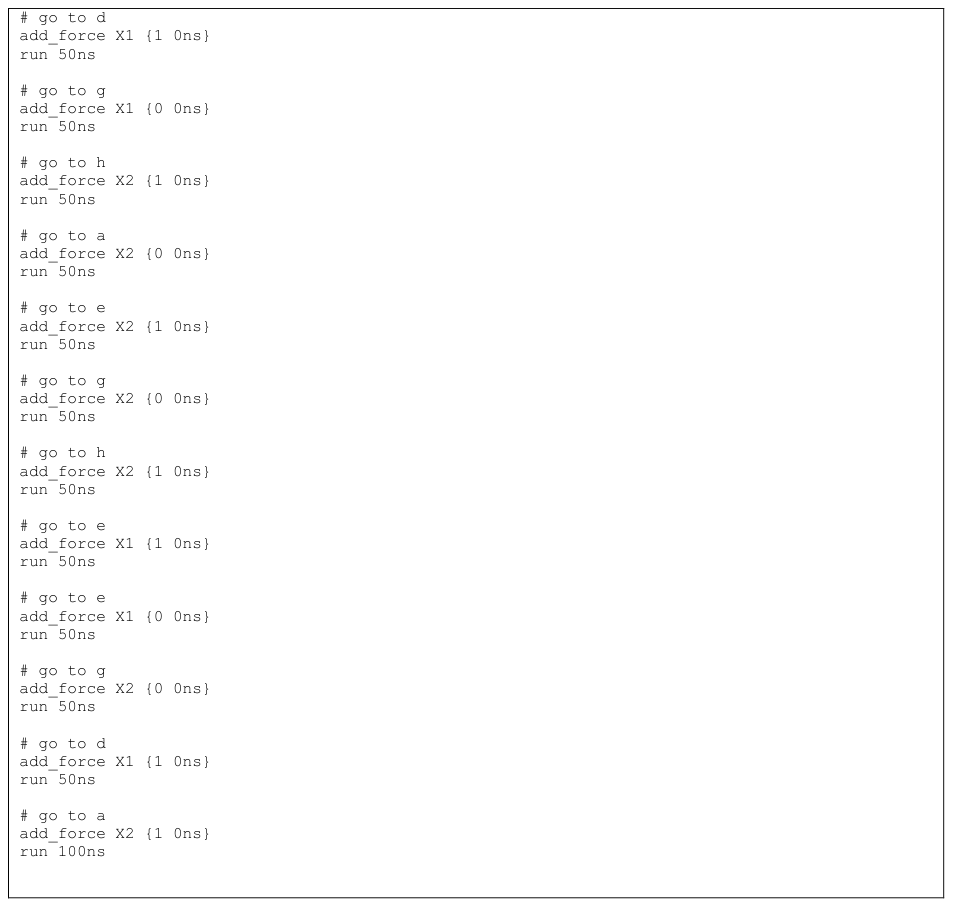
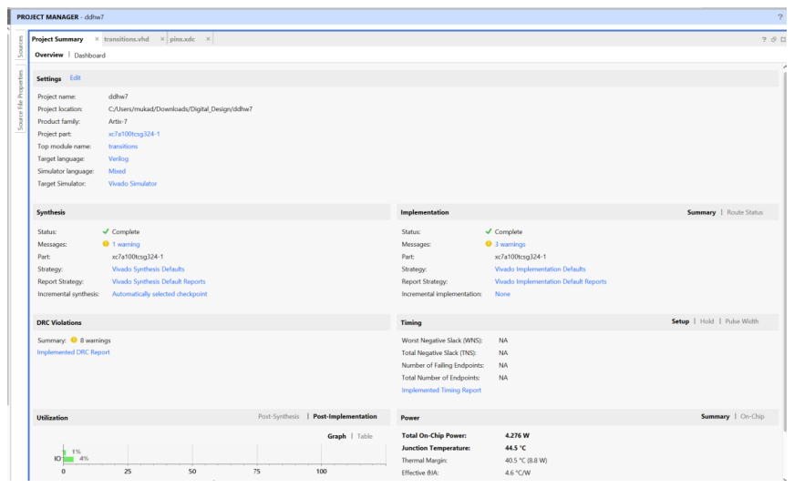
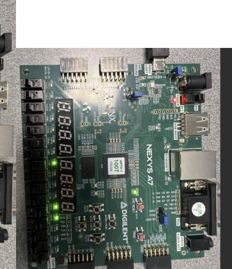
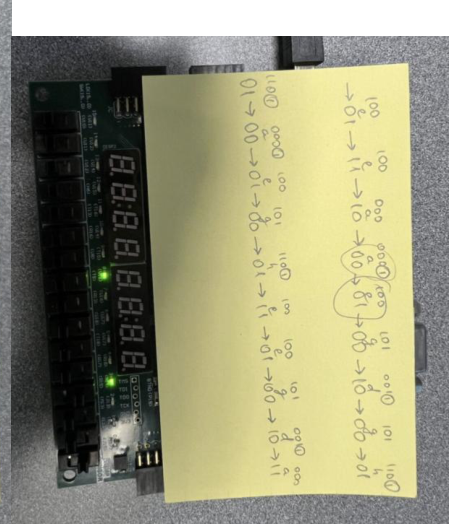
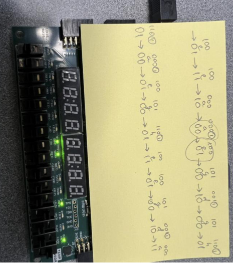
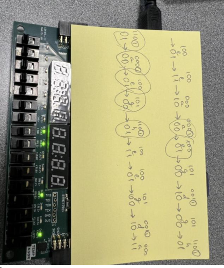

# Asynchronous State Machine (“transitions”) in VHDL (Nexys A7)

 **asynchronous sequential circuit** built around three feedback state bits (`Y1`, `Y2`, `Y3`) and two inputs (`X1`, `X2`).  
In other words: the “state” is the three `inout` signals looping back into the logic, and the circuit walks through states based on `X1/X2` patterns.

I implemented the boolean equations in VHDL, enabled the necessary combinational-loop setting in constraints, and verified behavior in simulation with a Tcl script **and** on real hardware (Nexys A7).

---

## Signals (at a glance)

**Inputs**
- `RESET` (active-low)
- `X1`, `X2`

**State (feedback / storage)**
- `Y1`, `Y2`, `Y3` *(declared as `inout` to allow the feedback loop)*

**Outputs**
- `Z`
- `X1_LED`, `X2_LED` (just mirrors of the input switches)

---

## How it’s implemented

The circuit is combinational equations feeding the state bits and output, with reset forcing things back to the start state.

### VHDL: entity + start of logic

### VHDL: rest of the equations (Y2 / Y3 / Z)

---

## Constraints (important for async feedback)

Because `Y1/Y2/Y3` feed back into themselves, Vivado needs combinational loops explicitly allowed:

---

## Simulation verification (Tcl force script)

I used a Tcl script to force `RESET`, then step through `X1/X2` changes so the circuit visits the intended states:

### Post-route sim waveform

---

## Hardware demo photos (Nexys A7)

A few shots from the board run (LEDs reflecting the active state bits and inputs):

---

## Notes

- In post-route sim you can see a brief “flicker” in one spot (around the ~650 ns area in my write-up) where the circuit can momentarily touch two reachable states before settling.  
  On the actual board run, following the same input pattern, it landed where expected.

---

## Report

See the included PDF for the full write-up + all screenshots.

## Report 

The write-up + screenshots are in the included PDF above

## Demo video

I also have a video uploaded above showing the project functioning.

